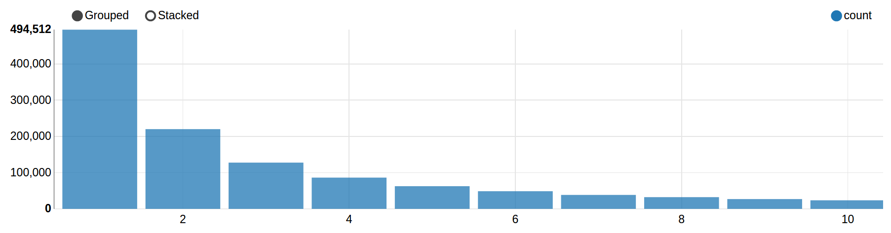

# Music Recommendator

Ce projet Spark démarre avec le chapitre 3 de [Advanced Analytics with Spark, 2nd Edition](https://www.oreilly.com/library/view/advanced-analytics-with/9781491972946/) au sujet d'un "recommendeur" d'artistes musicaux. Nous avons en partie suivi les idées de ce chapitre, mais avons également exploré d'autres pistes, en cherchant également à augmenter notre jeu de données. Le notebook Zeppelin contenant toutes les données et le code se trouve [ici](notebooks/2FA8UEGZS/note.json).

# Description de l'ensemble des données

## Données initiales provenant du livre

Les données initiales, fournies par le livre, comportent trois fichiers : `user_artist_data.txt`, `artist_data.txt` et `artist_alias.txt`. Le premier fichier contient environ 24.3 millions de lignes et trois colonnes, la 1ère contenant un id d'utilisateur (qui écoute de la musique), la 2ème un id d'artiste et la 3ème le nombre de fois que cet utilisateur a écouté cet artiste.

```bash
$ head user_artist_data.txt
1000002 1 55
1000002 1000006 33
1000002 1000007 8
1000002 1000009 144
1000002 1000010 314
1000002 1000013 8
1000002 1000014 42
1000002 1000017 69
1000002 1000024 329
1000002 1000025 1
```

Le deuxième fichier contient un peu plus que 1.8 millions de lignes et deux colonnes, la 1ère contenant un id d'artiste et la 2ème le nom d'artiste associé à l'id.

```bash
$ head artist_data.txt
1134999	06Crazy Life
6821360	Pang Nakarin
10113088	Terfel, Bartoli- Mozart: Don
10151459	The Flaming Sidebur
6826647	Bodenstandig 3000
10186265	Jota Quest e Ivete Sangalo
6828986	Toto_XX (1977
10236364	U.S Bombs -
1135000	artist formaly know as Mat
10299728	Kassierer - Musik für beide Ohren
```

Le troisième fichier contient 193'027 lignes et deux colonnes, la 1ère contenant un id d'artiste (au nom mal orthographié) et la 2ème l'id "canonique" pour cet artiste (au nom correctement orthographié).

```bash
$ head artist_alias.txt
1092764	1000311
1095122	1000557
6708070	1007267
10088054	1042317
1195917	1042317
1112006	1000557
1187350	1294511
1116694	1327092
6793225	1042317
1079959	1000557

```

## Données provenant de MusicBrainz

Nous voulions réaliser de nombreuses statistiques sur ces données en tirant profit de la puissance de Spark et SparkSQL, et même si la quantité des données est plutôt conséquente, le nombre d'informations différentes n'est pas énorme. Pour rester dans le thème, nous avons décidé de travailler sur les données provenant de [MusicBrainz](https://musicbrainz.org/), une source de données libre sur la musique et artistes. À partir de [cette description](https://musicbrainz.org/doc/MusicBrainz_Database/) des données, nous avons sélectionné les tables `artist`, `artist_type`, `gender`, `artist_tag`, `tag`, `area` et `area_type` que nous avons exporté en CSV pour les manipuler plus facilement dans Zeppelin. Ces différentes tables donnent des infos sur les artistes, comme leur nom, type (groupe, artiste seul, etc.), sexe (si applicable), indication (booléen) et dates de début et fin d'activité, zone géographique de provenance et des tags (genres) associés.

# Description des *features* utilisées
user id, artist id, count pour ALS
begin_date_year pour algos de clustering

# Questions pour lesquelles vous espérez obtenir une réponse à partir de l'analyse

# Algorithmes appliqués
K-means ?
- Clustering sur les gens qui écoutent les mêmes morceaux
- Tentative de graphe : les artistes et les users sont des noeuds et les écoutes sont des arcs


# Optimisations effectuées
Nous avons nettoyé les données "originales" en supprimant les noms d'artistes inconnus et les entrées d'écoute qui ne sont pas temporellement possibles : si on prend l'utilisateur avec l'id 2064012, nous aperçevons qu'il a écouté System Of A Down 439'771 fois. Un morceau de musique dure environ 4 minutes en moyenne, ce qui correspond dans notre cas à une écoute ininterrompue de 33 ans. Non seulement c'est une durée incroyable de manière absolue pour un temps d'écoute mais en plus le groupe System Of A Down a été créé dans les années 1990, ce qui confirme l'infaisabilité de ce cas.

<!-- # Your approach to testing and evaluation -->

# Résultats obtenus

## Statistiques sur les données originales

Nous avons réalisé de nombreuses statistiques sur les données, nous allons les présenter sous forme de tableaux et de graphiques.

### Fusion des données
Nous avons commencé par réaliser un Dataframe Spark, nommé `userArtistNamesCountDF`, avec les utilisateurs (ids), artistes (id et noms) et nombre d'écoutes que nous allons utiliser abondamment.

```scala
val userArtistNamesCountDF = 
    trainData
    .join(artistByID, artistByID("id") === trainData("artist"))
    .select("user", "artist", "name", "count")
userArtistNamesCountDF.cache
userArtistNamesCountDF.show
```
|   user|artist|      name|count|
|--------|-----|----------|----------|
|1000019|   463|The Smiths|    1|
|1000020|   463|The Smiths|  199|
|1000022|   463|The Smiths|   20|
|1000033|   463|The Smiths|  466|
|1000056|   463|The Smiths|   10|
|1000067|   463|The Smiths|   18|

### À propos des utilisateurs
Nous avons sommé le total des écoutes par utilisateur et retenu les 20 premiers par ordre décroissant d'écoutes :

|   user| total|
|-------|------|
|2069337|393515|
|2023977|285978|
|1059637|241350|
|1046559|183972|
|1052461|175822|
|1070932|168977|
|1031009|167028|
|2020513|165642|
|2062243|151482|
|2069889|143092|
|1001440|136266|
|2014936|135235|
|2017397|134032|
|1024631|122303|
|1007308|111274|
|2064012|108640|
|2023742|102030|
|1058890| 98472|
|1021940| 97318|
|1059245| 96037|

Nous pouvons voir que le premier a réalisé presque 400'000 écoutes cumulées ! Quelle attention !

Nous pouvons constaté qu'un utilisateur (1059637) a écouté "My Chemical Romance" presque 156'000 fois. Un vrai fan.

|   user|                name| total|
|-------|--------------------|------|
|1059637| My Chemical Romance|155895|
|2069889| Something Corporate|101076|
|2020513|      Mates of State| 89592|
|1073421|    Guided by Voices| 67548|
|2023977|            Maroon 5| 62815|
|2023977|   Alanis Morissette| 51039|
|2014936|          Pink Floyd| 36083|
|2069337|        Sage Francis| 34800|
|2013784|     Cannibal Corpse| 32768|
|2069337|          Jawbreaker| 31321|
|1073435|ASIAN KUNG-FU GEN...| 30043|
|2023977|          Guano Apes| 29983|
|1052225|               浜崎あゆみ| 29933|
|2017397|     New Found Glory| 26394|
|1045479|         The Beatles| 26135|
|2062243|           Music 205| 26107|
|1039100|              R.E.M.| 25858|
|1053554|    Boards of Canada| 25303|
|2017397|              Thrice| 24876|
|2216281|           Rammstein| 24067|

Voyons les moyennes d'écoutes sur les 148'077 utilisateurs différents : 

|summary|             count|
|-------|------------------|
|  count|            148077|
|   mean|162.66439757693632|
| stddev| 215.3813187758636|
|    min|                 1|
|    max|              6734|

Nous voyons qu'en moyenne, un utilisateur a écouté 162 artistes différents.

### À propos des utilisateurs
Nous avons dressé le top 20 des artistes les plus écoutés sur les 1'554'191 artistes au total.

|                name|  total|
|--------------------|-------|
|           Radiohead|2502596|
|         The Beatles|2259825|
|           Green Day|1931143|
|           Metallica|1543430|
|          Pink Floyd|1399665|
|     Nine Inch Nails|1361977|
|        Modest Mouse|1328969|
|         Bright Eyes|1234773|
|             Nirvana|1203348|
|                Muse|1148684|
| Death Cab for Cutie|1117277|
|Red Hot Chili Pep...|1088701|
|       Elliott Smith|1080542|
|           Rammstein|1047119|
|         Linkin Park|1028921|
|                  U2|1015494|
|           Nightwish|1010869|
|            Coldplay|1001417|
|    System of a Down| 986483|
|            Interpol| 979770|

Nous voyons, sans surprises, que des groupes mythiques s'y trouvent, comme les Beatles ou Metallica.
A l'inverse, nous avons également sélectionné les 20 moins bons :

|                name|total|
|--------------------|-----|
|Joe Budden, A Tea...|    1|
|Rae & Chritian - ...|    1|
|Alex Melcher, Peh...|    1|
|Dolly Parton - Mi...|    1|
|        Oneiropagida|    1|
|          Bravissimo|    1|
|The Middle Spunk ...|    1|
|The Last Emperor ...|    1|
|      12 Urban Tribe|    1|
|3EO35A5QUKMQXL3WV...|    1|
|         Jon Eberson|    1|
|gwar - Preskool P...|    1|
|Ayla-Liebe-Atb Remix|    1|
|macy gray (bugz i...|    1|
|Boys to Men & Cha...|    1|
|Apani B. Fly Emce...|    1|
|  Makaveli ft. Storm|    1|
|       Opération raï|    1|
|Parle ft jadakiss...|    1|
|Lil Kim, Mya, Pin...|    1|

On constate que ce tableau ne donne pas beaucoup d'informations, de nombreux artistes ont une seule écoute.
Voyons ce qu'il en est plus en détails. Regardons combien d'artistes ont été écoutés moins de 10 fois : 

```scala
val lessThanTenTimesListenedArtistsDF = listenedArtistsDF.filter("total <= 10")
val count = lessThanTenTimesListenedArtistsDF.count
val ratio = count.toDouble / distinctArtistsNumber.toDouble
```

```
count: Long = 1161120
ratio: Double = 0.7470896434222049
```

Plus qu'un million d'artistes ont été écoutés moins que 10 fois, cela représente quand même 75% des artistes.
Voyons voir la distribution entre 1 et 10 écoutes :

|total| count|
|-----|------|
|    1|494512|
|    2|220020|
|    3|127612|
|    4| 86240|
|    5| 62579|
|    6| 48704|
|    7| 38467|
|    8| 32332|
|    9| 27004|
|   10| 23650|



On voit que la plupart des artistes ont été écoutés qu'un seule fois. Voyons si la médianne confirme nos dires :

```scala
val mean = listenedArtistsDF.agg(avg("total")).head.getDouble(0)
val median = listenedArtistsDF.stat.approxQuantile("total", Array(0.5), 0.01)(0)
```

```
mean: Double = 238.32715067690853
median: Double = 3.0
```

La moyenne est à 238 tandis que la médianne est 3, ce qui confirme le graphique précédent, ce qui veut dire que la moitié des artistes ont été écoutés moins de trois fois, ce qu'on pourrait assimiler à des découvertes ou même à des erreurs d'écoutes.

## Statistiques sur les données de MusicBrainz

Montrer K-Means
Montrer une recommendation

# Améliorations futures possibles
- Optimiser les hyperparamètres pour le recommendeur : essayer de nombreuses combinaisons de paramètres d'entrée de l'algorithme d'apprentissage, pour trouver le meilleur modèle.
- Autre algorithme pour le recommendeur : essayer un autre algorithme que ALS -> mais lequel ? Existant ? Implémenté dans Spark ?
- Recommendations en temps réel : essayer un outil tel que [Oryx 2](http://oryx.io/) pour créer un système évolutif de recommendations de musiques, adaptant le modèle selon les nouvelles écoutes reçues en temps réel et personnalisé pour chaque utilisateur.
